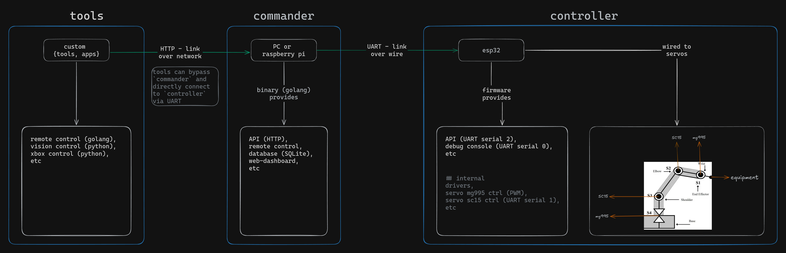
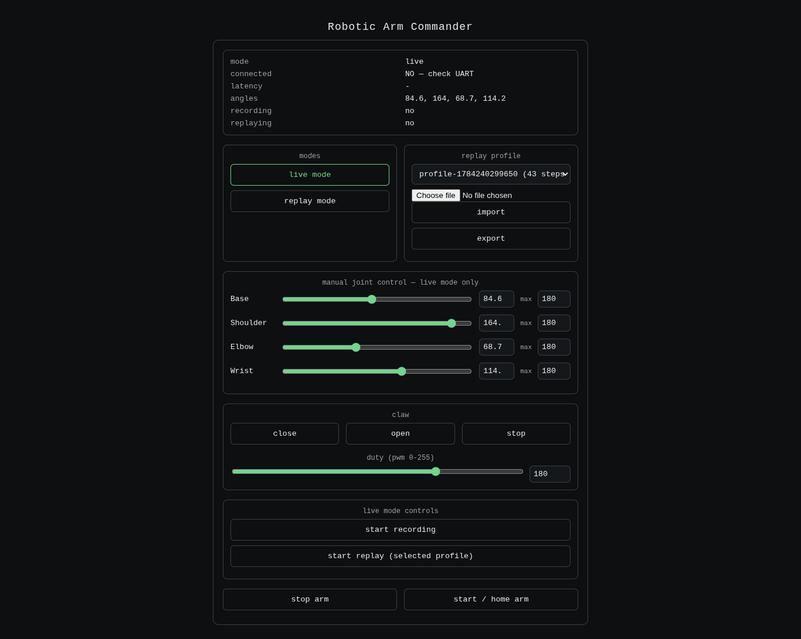

# roboarm-commander

Go commander for the Raspberry Pi Zero 2 W side of the arm. Owns the
UART link to the ESP32 controller, arm state (mode/angles/recording/
replay), SQLite-backed replay profiles, and the web dashboard.

## Architecture



Any client that speaks the commander's HTTP API can drive the arm
without touching firmware — teach-and-replay, remote control, an Xbox
controller (via `tools/xbox_bridge.py`), and a Python IBVS vision-servo
pipeline (`tools/vision_servo.py`) all sit at the `tools` tier. Tools
can also go direct-to-controller over UART when they need lower
latency than the commander hop.

The commander itself is a single Go binary: HTTP API in, UART out.
Controller input arrives over loopback UDP rather than directly, since
the Xbox bridge and the commander have different privilege/dependency
needs — see `internal/xbox/xbox.go`.

## Wire protocol

The commander speaks a byte-framed protocol to the ESP32 over UART —
`[0xAA][0x55][LEN][CMD][PAYLOAD...][CHECKSUM]`. Full command table and
rationale live in `roboarm-controller`'s README, since the controller
is the protocol's other half; `internal/protocol/protocol.go` is the
Go-side implementation, with `protocol_test.go` verifying exact wire
bytes rather than just round-tripping.

## Design notes

A few decisions worth knowing before reading the code:

- **Angles are stored in deg10** (tenths of a degree) internally,
  matching the SC15 servos' real resolution. Conversion to whole
  degrees happens only at the two boundaries that need human-readable
  numbers — the dashboard's JSON API and CSV import/export.
- **Jog input is decoupled from the UART send rate.** `Jog()` only
  updates in-memory target state; a separate `jogFlusher` goroutine
  sends one coalesced `MoveAll` frame at a fixed 25Hz cadence,
  regardless of how fast the controller reports input. Sending a
  frame per input event would flood the firmware's 16-deep command
  queue well past its drain rate.
- **Replay interpolates between keyframes** using the time gap between
  recorded steps, rather than commanding each step as fast as possible.
- **`Home()` runs mode-independently** — it's meant to work as a
  bottom-row "reset" control regardless of current mode, same as stop.

## Build

```bash
go mod tidy
CGO_ENABLED=1 go build -o roboarm ./cmd/roboarm
```

`mattn/go-sqlite3` needs CGO + a C compiler. Standard on Raspberry Pi
OS; if cross-compiling from a desktop instead, build on-device or set
up an ARM cross toolchain.

## Run

```bash
./roboarm --uart /dev/ttyUSB0 --baud 115200 --web :8080 --xbox 127.0.0.1:9999
python3 tools/xbox_bridge.py --host 127.0.0.1 --port 9999
python3 tools/vision_servo.py --camera tcp://10.42.1.1:5000 --kp 3 --max-step-deg 5 --deadzone-px 35 --rate 4 --headless --proc-scale 0.35
```

Then open `http://<pi-ip>:8080`.



## Status

- `go vet`, `go build`, and `go test` are clean; the protocol package
  has exact-bytes tests against the wire format.
- Not yet verified: end-to-end against real hardware (a physical
  ESP32 on the UART link, a real Xbox pad through the bridge, SQLite
  file permissions on an actual Pi filesystem).

## Not yet implemented

- `CmdSetTorque` / `CmdPing` exist in the protocol and firmware but
  aren't called from the Go side yet — not needed for jog/record/
  replay, only for future hybrid drag-teach or a dedicated latency
  stat separate from the 1Hz `GetState` poll.
- systemd units to run the Go binary + Python bridge on boot.

## License

Apache 2.0 — see [LICENSE](LICENSE).